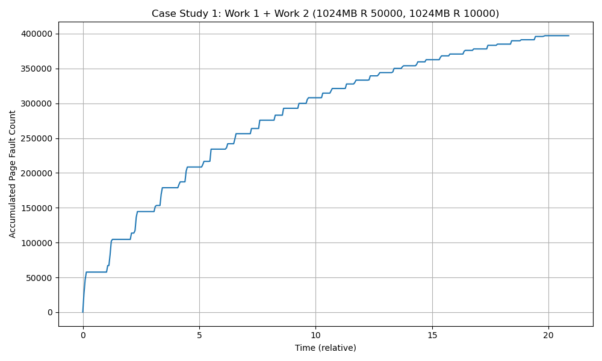
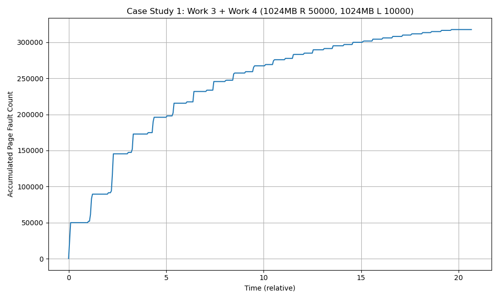
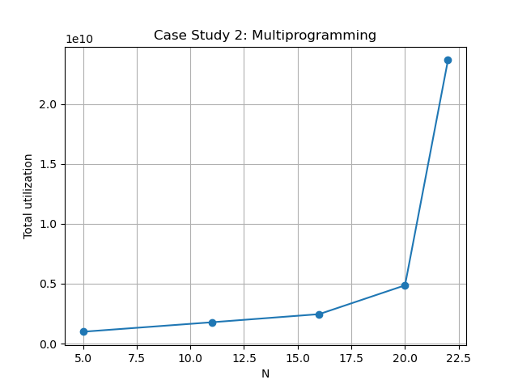

# Virtual Memory Page Fault Profiler


## 1. Project Overview

This project implements a Linux kernel module that profiles the virtual memory behavior of user-space processes. The profiler periodically samples the page fault counts and CPU utilization of registered processes, stores the data in an in-kernel shared buffer, and exposes the buffer to user space through a character device using `mmap()`.

The main goal of this MP is to understand how different memory access patterns and different degrees of multiprogramming affect page fault behavior, CPU utilization, and overall system performance.

The profiler supports:

- Registering and unregistering user processes through `/proc/mp3/status`
- Maintaining a kernel-side list of monitored PIDs
- Periodically sampling soft page faults, hard page faults, and CPU time
- Writing profiling samples into a shared kernel buffer
- Mapping the kernel buffer into user space through a character device
- Analyzing thrashing, locality, and multiprogramming effects using collected data

At a high level, the project demonstrates how the OS kernel can expose low-overhead profiling data to user space without repeatedly copying data between kernel memory and user memory.


## 2. System Architecture

The system consists of three major components:

1. **Work processes**
   - User-space benchmark programs that allocate memory and access it using either random access or locality-based access.
   - Each work process registers itself with the kernel module before execution and unregisters itself before exiting.

2. **MP3 kernel module**
   - Maintains the registered process list.
   - Periodically samples registered processes.
   - Stores profiling data in a shared buffer.
   - Provides both a proc filesystem interface and a character device interface.

3. **Monitor process**
   - Opens the character device node.
   - Calls `mmap()` to map the kernel profiler buffer into its own address space.
   - Reads profiling records directly from shared memory and prints them for post-processing.

The main data flow is:

```text
Work Process
    |
    | echo "R <PID>" / "U <PID>"
    v
/proc/mp3/status
    |
    v
MP3 Kernel Module
    |
    | periodic sampling at 20Hz
    v
Profiler Buffer allocated by vmalloc()
    |
    | mmap through character device
    v
Monitor Process
    |
    v
profile*.data -> plots -> analysis
````


## 3. Kernel Module Implementation

### 3.1 Proc Filesystem Interface

The kernel module creates the following proc filesystem entry:

```text
/proc/mp3/status
```

This proc entry supports both write and read operations.

The write callback supports two commands:

```text
R <PID>
U <PID>
```

* `R <PID>` registers a process for profiling.
* `U <PID>` unregisters a process from profiling.

The read callback returns the list of currently registered PIDs, with one PID per line.

Internally, the module parses the first character of the command to determine whether the operation is registration or unregistration. This provides a simple unified control interface for user-space workloads.


### 3.2 Registered Process List

The module maintains a linked list of registered processes. Each list node stores:

```c
struct listnode {
    pid_t pid;
    struct list_head node;
};
```

A mutex protects this list because it can be accessed by multiple kernel execution contexts:

* Proc write callback during registration and unregistration
* Proc read callback when listing registered PIDs
* Delayed work handler during periodic sampling
* Module cleanup during unload

The module starts profiling when the first process is registered. When the last process unregisters, the delayed work is cancelled because there are no remaining tasks to sample.

Duplicate registration is ignored to avoid adding the same PID multiple times.


### 3.3 Profiler Buffer

The profiler buffer is allocated in kernel space using:

```c
vmalloc()
```

`vmalloc()` is used because the buffer needs to be virtually contiguous, but it does not need to be physically contiguous. This is appropriate for a large profiler buffer because physically contiguous memory is more limited in the kernel.

The buffer size is:

```c
128 * PAGE_SIZE
```

The buffer is initialized to `-1`, which is the sentinel value expected by the provided monitor program. The monitor scans the buffer until it finds valid profiling records and resets consumed entries back to `-1`.

Each profiling sample contains four `unsigned long` values:

```text
[jiffies, minor_faults, major_faults, cpu_time]
```

where:

* `jiffies` is the kernel timer tick count at the time of sampling
* `minor_faults` is the total number of soft page faults across all registered processes
* `major_faults` is the total number of hard page faults across all registered processes
* `cpu_time` is the total CPU time, computed as `utime + stime`

The buffer stores up to 12,000 samples, and since each sample contains four values, the monitor reads up to 48,000 `long` entries.


### 3.4 Delayed Workqueue Sampling

The profiler uses a delayed workqueue to sample registered processes periodically.

The sampling interval is:

```text
50 ms
```

This gives a sampling rate of:

```text
20 samples per second
```

During each execution of the delayed work handler, the module iterates over the registered process list and calls the provided helper function:

```c
get_cpu_use(pid, &min_flt, &maj_flt, &utime, &stime)
```

For every valid registered process, the module accumulates:

```text
total_minor_faults += min_flt
total_major_faults += maj_flt
total_cpu_time += utime + stime
```

Then one sample is written into the profiler buffer.

If a PID is no longer valid, the corresponding node is removed from the registered list so that the profiler does not continue polling a stale process.

This design keeps the profiler lightweight and avoids unnecessary work after monitored processes terminate.


### 3.5 Character Device Interface

The module registers a character device using:

```c
register_chrdev_region()
cdev_init()
cdev_add()
```

The device uses:

```text
major number: 423
minor number: 0
```

After loading the module, the user can create the device node with:

```bash
sudo mknod node c 423 0
```

The character device implements three file operations:

```c
.open
.release
.mmap
```

The `open` and `release` callbacks are intentionally simple because the main purpose of the character device is to support memory mapping.


### 3.6 mmap Implementation

The most important character device operation is `mmap()`.

The monitor process maps the profiler buffer into its own address space by opening the device node and calling `mmap()`. The kernel module handles this request by mapping each page of the `vmalloc()` buffer into the user process's virtual memory area.

For each page, the module performs:

```c
pfn = vmalloc_to_pfn(kernel_buffer_page);
remap_pfn_range(vma, user_address, pfn, PAGE_SIZE, vma->vm_page_prot);
```

This creates a shared memory region between the kernel module and the monitor process. As a result, the monitor can read profiling data directly from memory instead of repeatedly invoking system calls or copying data from kernel space.

This is the key performance optimization in this MP.


## 4. Build and Run Instructions

### 4.1 Build the Kernel Module

Update the `KERNEL_SRC` path in the Makefile to point to the Linux kernel source tree, then run:

```bash
make
```

To clean generated build files:

```bash
make clean
```


### 4.2 Load the Module

```bash
sudo insmod mp3.ko
```

Check that the module loaded successfully:

```bash
dmesg
```

The proc entry should be available at:

```bash
/proc/mp3/status
```


### 4.3 Create the Character Device Node

```bash
sudo mknod node c 423 0
```


### 4.4 Run Workloads

Example workload:

```bash
nice ./work 1024 R 50000 &
nice ./work 1024 R 10000 &
```

The `work` program automatically registers itself with `/proc/mp3/status`, allocates memory, performs memory accesses, frees memory, and unregisters itself before exiting.


### 4.5 Collect Profiling Data

After the workload finishes, run:

```bash
./monitor > profile.data
```

The monitor maps the kernel profiler buffer through the character device and prints collected profiling samples.


### 4.6 Unload the Module

```bash
sudo rmmod mp3
```


## 5. Experimental Analysis

## 5.1 Case Study 1: Thrashing and Locality

The goal of this case study is to understand how page fault behavior changes based on memory access patterns.

### Experiment 1: Two Random Access Workloads

The first experiment runs two random-access workloads:

```bash
nice ./work 1024 R 50000 &
nice ./work 1024 R 10000 &
```

Both processes allocate 1024 MB of memory and access memory randomly. The difference is that the first process performs 50,000 accesses per iteration, while the second performs 10,000 accesses per iteration.

<p align="center">
  
</p>

The accumulated page fault count increases steadily over time. This behavior is expected because random memory access has poor spatial and temporal locality. Since accesses are distributed across a large address space, the process is more likely to touch pages that are not currently resident in memory.

The workload with 50,000 accesses per iteration creates more memory pressure than the workload with 10,000 accesses per iteration. As a result, it contributes more heavily to the overall page fault growth.

This experiment demonstrates that when memory access is random and the working set is large, the virtual memory system experiences frequent page faults.


### Experiment 2: Random Access vs. Locality-Based Access

The second experiment compares one random-access workload and one locality-based workload:

```bash
nice ./work 1024 R 50000 &
nice ./work 1024 L 10000 &
```

<p align="center">
  
</p>

Compared with the first experiment, the accumulated page fault count is lower. The key reason is locality.

The locality-based workload tends to reuse nearby memory locations, which means that once a page is brought into memory, future accesses are more likely to hit pages that are already resident. This reduces the number of new page faults.

In contrast, the random-access workload frequently jumps to unrelated locations across a large memory region. This makes it harder for the OS page replacement policy to keep useful pages in memory.

The difference between the two graphs shows that locality has a direct impact on virtual memory performance. Better locality reduces page fault pressure and usually improves completion time.


## 5.2 Case Study 2: Multiprogramming

The goal of this case study is to analyze how CPU utilization changes as the degree of multiprogramming increases.

The workload used in this experiment is:

```bash
./work 200 R 10000
```

The experiment runs `N` copies of this workload, where:

```text
N = 5, 11, 16, 20, 22
```

The graph plots total CPU utilization as a function of `N`.

<p align="center">
  
</p>

As `N` increases, the total amount of work in the system increases. With more processes running concurrently, the system has more runnable tasks, so total CPU utilization initially increases.

However, when `N` becomes large, the combined working set becomes too large for physical memory. Each process uses 200 MB, so high values of `N` create significant memory pressure:

```text
N = 5   -> about 1000 MB total working set
N = 11  -> about 2200 MB total working set
N = 16  -> about 3200 MB total working set
N = 20  -> about 4000 MB total working set
N = 22  -> about 4400 MB total working set
```

At high degrees of multiprogramming, the total working set exceeds available physical memory. This causes frequent page replacement and swap activity. The system begins to spend more time handling page faults instead of making useful progress. This behavior is known as thrashing.

The sharp increase at high `N` indicates that completion time becomes much longer under heavy memory pressure. Since the plotted value is total accumulated CPU utilization across the entire run, a longer completion time can produce a much larger accumulated utilization value.

This experiment shows that increasing multiprogramming improves utilization only up to a point. Once memory pressure becomes severe, additional processes can reduce overall efficiency because the system spends more time handling virtual memory overhead.


## 6. Design Decisions

### 6.1 Why Use vmalloc?

The profiler buffer is relatively large, and it only needs to be virtually contiguous. It does not need to be physically contiguous. Therefore, `vmalloc()` is a better fit than `kmalloc()` because `kmalloc()` requires physically contiguous memory, which can be harder to allocate for larger buffers.


### 6.2 Why Use mmap?

A user-space profiler could repeatedly read data from the kernel through system calls, but that would introduce unnecessary overhead from context switches and data copying.

Using `mmap()` allows the monitor process to read the kernel profiler buffer directly through a shared mapping. This design greatly reduces profiling overhead and matches the goal of building a lightweight profiler.


### 6.3 Why Use a Delayed Workqueue?

The profiler needs to run periodically but should not block user processes. A delayed workqueue is appropriate because it allows the module to schedule recurring work at a fixed interval.

The work handler samples the registered processes every 50 ms and then re-arms itself using delayed work scheduling.


### 6.4 Why Use a Mutex?

The registered process list is shared by multiple contexts. Without synchronization, concurrent access could corrupt the list or lead to use-after-free bugs.

The mutex protects list operations during:

* registration
* unregistration
* proc read
* periodic sampling
* cleanup

This ensures that process list operations are safe.


## 7. Results Summary

The experiments confirm several important virtual memory concepts:

1. Random access causes more page faults than locality-based access.
2. Locality reduces page fault pressure because recently used pages are more likely to be reused.
3. Increasing multiprogramming can initially improve CPU utilization.
4. Excessive multiprogramming can cause memory pressure and thrashing.
5. When the combined working set exceeds physical memory, completion time increases significantly.
6. A kernel-space profiler with an `mmap()` shared buffer can collect high-frequency profiling data with low overhead.


## 8. Repository Structure

```text
.
├── mp3.c                 # MP3 kernel module implementation
├── mp3_given.h           # Provided helper functions for task lookup and CPU/page-fault stats
├── work.c                # User-space workload generator
├── monitor.c             # User-space monitor that mmaps the profiler buffer
├── README.md             # Project documentation and analysis
└── plots/
    ├── case_1_work_1_2.png
    ├── case_1_work_3_4.png
    └── case_2.png
```
